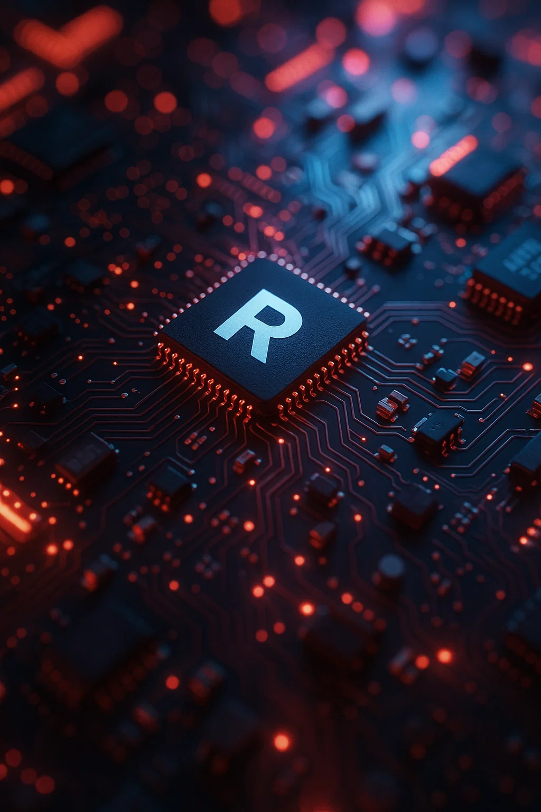

# Hi there! 👋 I'm Radu Sburlea

An open-minded and enthusiastic software engineering student, always ready to embrace new opportunities and challenges with passion and determination. Proficient in C++, Java, and Python, I excel at solving complex problems and delivering innovative solutions. My commitment to continuous learning drives me to improve and adapt in the ever-evolving tech landscape. As a diligent hard-worker and a collaborative team player, I thrive in team settings, contributing effectively while fostering a positive and productive atmosphere. My goal is to make a meaningful impact in the tech industry through creativity, dedication, and excellence.

## 🌐 Connect with Me

  
  
  

---

## 💻 Tech Stack & Tools

My current toolkit includes:

**Languages:**

  
  
  
  
  
  

**Frameworks & Libraries:**

  
  
  
  
  
  
  
  

**Databases & Cloud:**

  
  

**Tools & Others:**

  
  
  
  
  
  
  
  
  

---

## 📊 My GitHub Stats & Activity

> Projects that i worked on / contributed to:

- 🔗 [MirunaRatiu/SixthSense](https://github.com/MirunaRatiu/SixthSense)
- 🔗 [Radu-Sb33/StackOverflow](https://github.com/Radu-Sb33/StackOverflow)
- 🔗 [MirunaRatiu/Radiali-Website](https://github.com/MirunaRatiu/Radiali-Website)
- 🔗 [Radu-Sb33/Graphics_Project](https://github.com/Radu-Sb33/Graphics_Project)
- 🔗 [Radu-Sb33/Jumping-Frog](https://github.com/Radu-Sb33/Jumping-Frog)
- 🔗 [Radu-Sb33/MIPS_Pipeline](https://github.com/Radu-Sb33/MIPS_Pipeline)
- 🔗 [Radu-Sb33/Image_Binarization](https://github.com/Radu-Sb33/Image_Binarization)

---

## 🏆 GitHub Trophies

